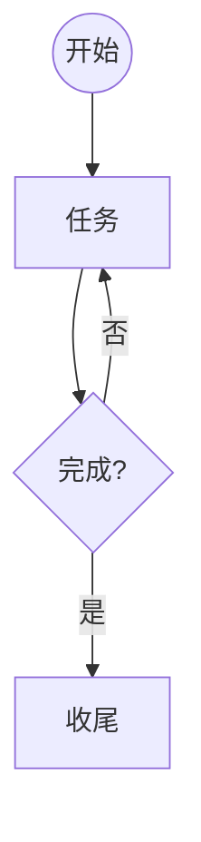

# svg-to-mermaid 技能实现计划

> **For agentic workers:** REQUIRED SUB-SKILL: Use superpowers:subagent-driven-development (recommended) or superpowers:executing-plans to implement this plan task-by-task. Steps use checkbox (`- [ ]`) syntax for tracking.

**Goal:** 开发一个部署于当前项目的 Reasonix 技能,将用户上传的任意来源 SVG 矢量流程图转换为可渲染的 Mermaid 流程图文本。

**Architecture:** 两层混合。`svg2struct.py`(Python 3 标准库,零依赖)确定性解析 SVG,提取文本框/形状/连线坐标并关联成 JSON 中间表示(节点表+边表);agent(LLM)基于该中间表示做语义组织,输出 Mermaid 语法。

**Tech Stack:** Python 3.12(标准库 `xml.etree.ElementTree`、`json`)、unittest(标准库)、SVG/Mermaid。

## Global Constraints

- 仅使用 Python 标准库,零第三方依赖(环境无 pip 安装权限保障)
- 脚本可独立运行:`python3 scripts/svg2struct.py <file.svg>`,输出 JSON 到 stdout
- 部署位置固定:`.reasonix/skills/svg-to-mermaid/`(当前项目,project scope)
- 测试框架:unittest(无 pytest),从技能根目录运行 `python3 -m unittest discover -s tests -p "test_*.py" -v`
- Mermaid 输出遵循:flowchart TD/LR;节点符号 `A[处理]` `B{判断?}` `C((起止))` `D[/输入输出/]`;边 `A --> B`、带标签 `A -->|是| B`;泳道用 `subgraph`
- 中间表示 JSON 结构固定:
  ```json
  {"nodes": [{"id": "n1", "text": "开始", "type": "ellipse", "cx": 100.0, "cy": 50.0}],
   "edges": [{"from": "n1", "to": "n2", "label": "是"}],
   "swimlanes": [{"id": "s0", "label": "接收", "cx": 90.0, "cy": 150.0, "w": 180.0, "h": 300.0}]}
  ```
- `type` 取值:`rect`(含圆角矩形)、`diamond`、`ellipse`(含 circle)、`polygon`
- 每任务结束提交一次 git(workspace 独立仓库 `fc697f5` 之后)

---

### Task 1: 脚本骨架 + XML 加载 + 文本框提取

**Files:**
- Create: `.reasonix/skills/svg-to-mermaid/scripts/svg2struct.py`
- Create: `.reasonix/skills/svg-to-mermaid/tests/test_svg2struct.py`
- Create: `.reasonix/skills/svg-to-mermaid/tests/fixtures/text_sample.svg`

**Interfaces:**
- Produces: `svg2struct.parse_svg(xml_text: str) -> dict`(完整中间表示,本任务先返回 `{"nodes": [...], "edges": []}`);`svg2struct.extract_texts(root) -> list[dict]`,每个 dict 含 `{"id","text","x","y"}`;`svg2struct._translate_point(x, y, transform) -> (x, y)`(处理 `translate` 与 `scale`)

- [ ] **Step 1: 写失败的测试**

创建 `.reasonix/skills/svg-to-mermaid/tests/fixtures/text_sample.svg`:

```xml
<svg xmlns="http://www.w3.org/2000/svg" width="400" height="200">
  <text x="50" y="60">开始</text>
  <g transform="translate(100, 20)">
    <text x="10" y="30">处理<tspan>步骤</tspan></text>
  </g>
</svg>
```

创建 `.reasonix/skills/svg-to-mermaid/tests/test_svg2struct.py`:

```python
import os
import sys
import unittest

sys.path.insert(0, os.path.join(os.path.dirname(__file__), "..", "scripts"))
import svg2struct

FIXTURES = os.path.join(os.path.dirname(__file__), "fixtures")


def load(name):
    with open(os.path.join(FIXTURES, name), encoding="utf-8") as f:
        return f.read()


class TestExtractTexts(unittest.TestCase):
    def test_plain_text_and_tspan(self):
        root = svg2struct.parse_svg(load("text_sample.svg"))
        texts = {t["text"]: t for t in root["nodes"] if t["type"] == "text"}
        self.assertIn("开始", texts)
        self.assertEqual(texts["开始"]["x"], 50)
        self.assertEqual(texts["开始"]["y"], 60)

    def test_transform_translate_applied(self):
        root = svg2struct.parse_svg(load("text_sample.svg"))
        texts = {t["text"]: t for t in root["nodes"] if t["type"] == "text"}
        self.assertIn("处理步骤", texts)  # tspan 合并
        self.assertEqual(texts["处理步骤"]["x"], 110)  # 10 + 100
        self.assertEqual(texts["处理步骤"]["y"], 50)  # 30 + 20


if __name__ == "__main__":
    unittest.main()
```

- [ ] **Step 2: 运行测试确认失败**

Run: `cd .reasonix/skills/svg-to-mermaid && python3 -m unittest discover -s tests -p "test_*.py" -v`
Expected: FAIL(ModuleNotFoundError: No module named 'svg2struct')

- [ ] **Step 3: 最小实现**

创建 `.reasonix/skills/svg-to-mermaid/scripts/svg2struct.py`:

```python
#!/usr/bin/env python3
"""SVG 流程图 → 结构化中间表示(节点表 + 边表)。

仅使用标准库。输出 JSON 到 stdout(供 LLM 组织成 Mermaid)。
"""
import json
import re
import sys
import xml.etree.ElementTree as ET

NS = {"svg": "http://www.w3.org/2000/svg"}


def _tag(t):
    return t.split("}")[-1]  # 去掉命名空间前缀


def _parse_transform(transform):
    """解析 transform 字符串,返回 (tx, ty, sx, sy)。支持 translate/scale,忽略其余。"""
    tx = ty = 0.0
    sx = sy = 1.0
    if not transform:
        return tx, ty, sx, sy
    for m in re.finditer(r"(translate|scale)\(\s*([^)]+)\)", transform):
        kind, args = m.group(1), m.group(2).replace(",", " ").split()
        nums = [float(a) for a in args if a]
        if kind == "translate" and nums:
            tx, ty = nums[0], nums[1] if len(nums) > 1 else 0.0
        elif kind == "scale" and nums:
            sx = nums[0]
            sy = nums[1] if len(nums) > 1 else nums[0]
    return tx, ty, sx, sy


def _translate_point(x, y, transform):
    tx, ty, sx, sy = _parse_transform(transform)
    return x * sx + tx, y * sy + ty


def _parent_map(root):
    """构建 {子元素: 父元素} 映射,用于沿祖先链累积 transform。"""
    return {child: parent for parent in root.iter() for child in parent}


def _transforms(el, parent_map):
    """返回从根到该元素的 transform 字符串列表(祖先在前,自身在后)。"""
    chain = []
    cur = el
    while cur is not None:
        t = cur.get("transform")
        if t:
            chain.append(t)
        cur = parent_map.get(cur)
    return list(reversed(chain))


def _apply_transforms(x, y, transforms):
    """按顺序应用祖先→自身的 transform 链。"""
    for t in transforms:
        x, y = _translate_point(x, y, t)
    return x, y


def extract_texts(root):
    """提取所有 <text> 与 <foreignObject> 内嵌文字。"""
    parent_map = _parent_map(root)
    texts = []
    for i, el in enumerate(root.iter()):
        tag = _tag(el.tag)
        if tag == "text":
            parts = []
            for child in el.iter():
                if child.tag.split("}")[-1] == "tspan" and child.text:
                    parts.append(child.text)
                elif child.tag.split("}")[-1] == "text" and child.text:
                    parts.append(child.text)
            if not parts and el.text:
                parts.append(el.text)
            text = "".join(parts).strip()
            if not text:
                continue
            x = float(el.get("x", "0") or 0)
            y = float(el.get("y", "0") or 0)
            x, y = _apply_transforms(x, y, _transforms(el, parent_map))
            texts.append({"id": f"t{i}", "text": text, "type": "text",
                          "x": x, "y": y})
        elif tag == "foreignObject":
            div_text = "".join(el.itertext()).strip()
            if div_text:
                x = float(el.get("x", "0") or 0)
                y = float(el.get("y", "0") or 0)
                x, y = _apply_transforms(x, y, _transforms(el, parent_map))
                texts.append({"id": f"t{i}", "text": div_text, "type": "text",
                              "x": x, "y": y})
    return texts


def parse_svg(xml_text):
    root = ET.fromstring(xml_text)
    return {"nodes": extract_texts(root), "edges": []}


def main():
    if len(sys.argv) != 2:
        print("usage: svg2struct.py <file.svg>", file=sys.stderr)
        sys.exit(2)
    with open(sys.argv[1], encoding="utf-8") as f:
        print(json.dumps(parse_svg(f.read()), ensure_ascii=False, indent=2))


if __name__ == "__main__":
    main()
```

- [ ] **Step 4: 运行测试确认通过**

Run: `cd .reasonix/skills/svg-to-mermaid && python3 -m unittest discover -s tests -p "test_*.py" -v`
Expected: 2 个测试 PASS

- [ ] **Step 5: 提交**

```bash
cd /Users/yuxia/.reasonix/global-workspace && git add .reasonix/skills/svg-to-mermaid && git commit -m "feat: svg2struct 脚本骨架与文本框提取"
```

---

### Task 2: 形状提取(rect / 菱形 / 椭圆)

**Files:**
- Modify: `.reasonix/skills/svg-to-mermaid/scripts/svg2struct.py`(新增 `extract_shapes`,并入 `parse_svg`)
- Modify: `.reasonix/skills/svg-to-mermaid/tests/test_svg2struct.py`
- Create: `.reasonix/skills/svg-to-mermaid/tests/fixtures/shapes_sample.svg`

**Interfaces:**
- Produces: `svg2struct.extract_shapes(root) -> list[dict]`,每个 dict 含 `{"id","type","cx","cy","w","h"}`;`type` ∈ `rect|diamond|ellipse|polygon`;`cx/cy` 为包围盒中心

- [ ] **Step 1: 写失败的测试**

创建 `.reasonix/skills/svg-to-mermaid/tests/fixtures/shapes_sample.svg`:

```xml
<svg xmlns="http://www.w3.org/2000/svg" width="500" height="300">
  <rect x="20" y="30" width="120" height="40" rx="4"/>
  <ellipse cx="250" cy="50" rx="60" ry="25"/>
  <polygon points="400,70 480,50 480,90 400,70"/>
  <g transform="translate(0, 100)">
    <rect x="20" y="30" width="100" height="40"/>
  </g>
</svg>
```

在 `tests/test_svg2struct.py` 追加:

```python
class TestExtractShapes(unittest.TestCase):
    def test_shape_types_and_centers(self):
        root = svg2struct.parse_svg(load("shapes_sample.svg"))
        shapes = {s["id"]: s for s in root["nodes"]
                  if s["type"] != "text"}
        types = sorted(s["type"] for s in shapes.values())
        self.assertEqual(types, ["diamond", "ellipse", "rect", "rect"])
        rect1 = next(s for s in shapes.values() if s["cx"] == 80 and s["cy"] == 50)
        self.assertEqual(rect1["type"], "rect")
        self.assertEqual(rect1["w"], 120)
        self.assertEqual(rect1["h"], 40)
        # transform translate(0,100) 生效:第二个 rect 中心 y = 30+100+20 = 150
        rect2 = next(s for s in shapes.values() if s["cx"] == 70)
        self.assertEqual(rect2["cy"], 150)
        # polygon 4 点 → diamond
        dia = next(s for s in shapes.values() if s["type"] == "diamond")
        self.assertEqual(dia["cx"], 440)
        self.assertEqual(dia["cy"], 70)
```

- [ ] **Step 2: 运行测试确认失败**

Run: `cd .reasonix/skills/svg-to-mermaid && python3 -m unittest discover -s tests -p "test_*.py" -v`
Expected: FAIL(AttributeError: module 'svg2struct' has no attribute 'extract_shapes')

- [ ] **Step 3: 实现形状提取**

在 `svg2struct.py` 中 `parse_svg` 之前新增:

```python
def _shape_center(x, y, w, h):
    return x + w / 2.0, y + h / 2.0


def extract_shapes(root):
    parent_map = _parent_map(root)
    shapes = []
    for i, el in enumerate(root.iter()):
        tag = _tag(el.tag)
        transforms = _transforms(el, parent_map)
        if tag == "rect":
            x = float(el.get("x", "0") or 0)
            y = float(el.get("y", "0") or 0)
            w = float(el.get("width", "0") or 0)
            h = float(el.get("height", "0") or 0)
            cx, cy = _shape_center(x, y, w, h)
            cx, cy = _apply_transforms(cx, cy, transforms)
            # 大矩形(泳道/分区容器,如 draw.io swimlane)不作为流程节点
            kind = "container" if w > 150 and h > 150 else "rect"
            shapes.append({"id": f"s{i}", "type": kind,
                           "cx": cx, "cy": cy, "w": w, "h": h})
        elif tag == "ellipse":
            cx = float(el.get("cx", "0") or 0)
            cy = float(el.get("cy", "0") or 0)
            rx = float(el.get("rx", "0") or 0)
            ry = float(el.get("ry", "0") or 0)
            cx, cy = _apply_transforms(cx, cy, transforms)
            shapes.append({"id": f"s{i}", "type": "ellipse",
                           "cx": cx, "cy": cy, "w": rx * 2, "h": ry * 2})
        elif tag == "circle":
            cx = float(el.get("cx", "0") or 0)
            cy = float(el.get("cy", "0") or 0)
            r = float(el.get("r", "0") or 0)
            cx, cy = _apply_transforms(cx, cy, transforms)
            shapes.append({"id": f"s{i}", "type": "ellipse",
                           "cx": cx, "cy": cy, "w": r * 2, "h": r * 2})
        elif tag == "polygon":
            pts = el.get("points", "")
            coords = [float(v) for v in pts.replace(",", " ").split() if v]
            if len(coords) >= 6:
                xs = coords[0::2]
                ys = coords[1::2]
                cx = sum(xs) / len(xs)
                cy = sum(ys) / len(ys)
                cx, cy = _apply_transforms(cx, cy, transforms)
                kind = "diamond" if len(xs) == 4 else "polygon"
                shapes.append({"id": f"s{i}", "type": kind,
                               "cx": cx, "cy": cy,
                               "w": max(xs) - min(xs), "h": max(ys) - min(ys)})
    return shapes
```

同时修改 `parse_svg`:

```python
def parse_svg(xml_text):
    root = ET.fromstring(xml_text)
    return {"nodes": extract_texts(root) + extract_shapes(root), "edges": []}
```

- [ ] **Step 4: 运行测试确认通过**

Run: `cd .reasonix/skills/svg-to-mermaid && python3 -m unittest discover -s tests -p "test_*.py" -v`
Expected: 全部 PASS(Task 1 的 2 个 + 本任务 1 个)

- [ ] **Step 5: 提交**

```bash
cd /Users/yuxia/.reasonix/global-workspace && git add .reasonix/skills/svg-to-mermaid && git commit -m "feat: 形状提取(rect/diamond/ellipse)"
```

---

### Task 3: 连线提取与箭头方向

**Files:**
- Modify: `.reasonix/skills/svg-to-mermaid/scripts/svg2struct.py`(新增 `extract_edges`)
- Modify: `.reasonix/skills/svg-to-mermaid/tests/test_svg2struct.py`
- Create: `.reasonix/skills/svg-to-mermaid/tests/fixtures/edges_sample.svg`

**Interfaces:**
- Produces: `svg2struct.extract_edges(root) -> list[dict]`,每个 dict 含 `{"x1","y1","x2","y2","directed"}`;`directed` 依据 `marker-end` 或 draw.io `endArrow`;`<line>` 无 marker 且无 endArrow 时视为无向(`directed=False`);坐标已应用 transform

- [ ] **Step 1: 写失败的测试**

创建 `.reasonix/skills/svg-to-mermaid/tests/fixtures/edges_sample.svg`:

```xml
<svg xmlns="http://www.w3.org/2000/svg" width="400" height="200"
     xmlns:xlink="http://www.w3.org/1999/xlink">
  <defs>
    <marker id="arrow" orient="auto" markerWidth="6" markerHeight="6" refX="5" refY="3">
      <path d="M0,0 L6,3 L0,6 z"/>
    </marker>
  </defs>
  <line x1="30" y1="30" x2="130" y2="30" marker-end="url(#arrow)"/>
  <polyline points="30,80 80,80 80,150" fill="none" marker-end="url(#arrow)"/>
  <line x1="200" y1="30" x2="300" y2="30" stroke="black"/>
</svg>
```

在 `tests/test_svg2struct.py` 追加:

```python
class TestExtractEdges(unittest.TestCase):
    def test_edges_and_direction(self):
        edges = svg2struct.extract_edges(
            svg2struct._parse(load("edges_sample.svg")))
        self.assertEqual(len(edges), 3)
        directed = [e for e in edges if e["directed"]]
        undirected = [e for e in edges if not e["directed"]]
        self.assertEqual(len(directed), 2)
        self.assertEqual(len(undirected), 1)
        # polyline 终点 = 最后一个点
        poly = next(e for e in edges if e["x1"] == 30 and e["y1"] == 80)
        self.assertEqual((poly["x2"], poly["y2"]), (80, 150))
```

- [ ] **Step 2: 运行测试确认失败**

Run: `cd .reasonix/skills/svg-to-mermaid && python3 -m unittest discover -s tests -p "test_*.py" -v`
Expected: FAIL(AttributeError: module 'svg2struct' has no attribute 'extract_edges')

- [ ] **Step 3: 实现连线提取**

在 `svg2struct.py` 新增辅助函数与 `extract_edges`:

```python
def _parse(xml_text):
    return ET.fromstring(xml_text)


def _path_points(d):
    """解析 path 的 M/L/Q/C 命令,返回坐标点列表(best-effort)。"""
    pts = []
    for cmd, nums in re.findall(r"([MmLlCcQq])\s*([-\d.,\s]+)", d):
        vals = [float(v) for v in nums.replace(",", " ").split() if v]
        for i in range(0, len(vals) - 1, 2):
            pts.append((vals[i], vals[i + 1]))
    return pts


def extract_edges(root):
    parent_map = _parent_map(root)
    edges = []
    for i, el in enumerate(root.iter()):
        tag = _tag(el.tag)
        if tag not in ("line", "polyline", "path"):
            continue
        transforms = _transforms(el, parent_map)
        directed = False
        if el.get("marker-end"):
            directed = True
        # draw.io 用 endArrow 属性(可能挂在 style 里,已由转换后的属性承载)
        if el.get("endArrow") and el.get("endArrow") != "none":
            directed = True
        if tag == "line":
            x1 = float(el.get("x1", "0") or 0)
            y1 = float(el.get("y1", "0") or 0)
            x2 = float(el.get("x2", "0") or 0)
            y2 = float(el.get("y2", "0") or 0)
            x1, y1 = _apply_transforms(x1, y1, transforms)
            x2, y2 = _apply_transforms(x2, y2, transforms)
            edges.append({"id": f"e{i}", "x1": x1, "y1": y1,
                          "x2": x2, "y2": y2, "directed": directed})
        elif tag == "polyline":
            coords = [float(v) for v in
                      (el.get("points") or "").replace(",", " ").split() if v]
            if len(coords) >= 4:
                x1, y1 = _apply_transforms(coords[0], coords[1], transforms)
                x2, y2 = _apply_transforms(coords[-2], coords[-1], transforms)
                edges.append({"id": f"e{i}", "x1": x1, "y1": y1,
                              "x2": x2, "y2": y2, "directed": directed})
        elif tag == "path":
            pts = _path_points(el.get("d") or "")
            if len(pts) >= 2:
                x1, y1 = _apply_transforms(pts[0][0], pts[0][1], transforms)
                x2, y2 = _apply_transforms(pts[-1][0], pts[-1][1], transforms)
                edges.append({"id": f"e{i}", "x1": x1, "y1": y1,
                              "x2": x2, "y2": y2, "directed": directed})
    return edges
```

- [ ] **Step 4: 运行测试确认通过**

Run: `cd .reasonix/skills/svg-to-mermaid && python3 -m unittest discover -s tests -p "test_*.py" -v`
Expected: 全部 PASS

- [ ] **Step 5: 提交**

```bash
cd /Users/yuxia/.reasonix/global-workspace && git add .reasonix/skills/svg-to-mermaid && git commit -m "feat: 连线提取与箭头方向识别"
```

---

### Task 4: 节点聚合 + 端点最近邻关联 → 完整中间表示

**Files:**
- Modify: `.reasonix/skills/svg-to-mermaid/scripts/svg2struct.py`(新增 `assemble_nodes`、`match_edges`,重写 `parse_svg`)
- Modify: `.reasonix/skills/svg-to-mermaid/tests/test_svg2struct.py`
- Create: `.reasonix/skills/svg-to-mermaid/tests/fixtures/small_flow.svg`

**Interfaces:**
- Produces: `svg2struct.assemble_nodes(texts, shapes) -> list[dict]`——文字落入形状包围盒(含 8px 容差)则合并为该形状的 `text`;未落入任何形状的独立文字单独成节点(`type="text"`);节点 `id` 形如 `n0, n1, …`;容器矩形(`type="container"`,w>150 且 h>150)不参与节点
- Produces: `svg2struct._swimlanes(containers, texts) -> list[dict]`——容器矩形转泳道信息 `{"id","label","cx","cy","w","h"}`,`label` 为落入容器的首个文字
- Produces: `svg2struct.match_edges(nodes, edges) -> list[dict]`——每条连线的两端各找最近的节点中心,生成 `{"from","to","label"}`;`label` 为空字符串(连线标签由 Task 5 补充);无向边 `directed=False` 仍输出 from→to 方向不变
- Produces: `parse_svg` 返回 `{"nodes","edges","swimlanes"}` 三字段

- [ ] **Step 1: 写失败的测试**

创建 `.reasonix/skills/svg-to-mermaid/tests/fixtures/small_flow.svg`:

```xml
<svg xmlns="http://www.w3.org/2000/svg" width="500" height="300">
  <ellipse cx="100" cy="50" rx="50" ry="22"/>
  <text x="100" y="55" text-anchor="middle">开始</text>
  <rect x="70" y="130" width="60" height="36"/>
  <text x="100" y="153" text-anchor="middle">处理</text>
  <polygon points="250,128 320,148 320,168 250,148"/>
  <text x="285" y="153" text-anchor="middle">通过?</text>
  <line x1="100" y1="72" x2="100" y2="130" marker-end="url(#a)"/>
  <line x1="130" y1="148" x2="250" y2="148" marker-end="url(#a)"/>
</svg>
```

在 `tests/test_svg2struct.py` 追加:

```python
class TestAssembleAndMatch(unittest.TestCase):
    def test_full_small_flow(self):
        root = svg2struct.parse_svg(load("small_flow.svg"))
        nodes = root["nodes"]
        self.assertEqual(len(nodes), 3)  # 开始 / 处理 / 通过?(文字已并入形状)
        start = next(n for n in nodes if n["text"] == "开始")
        self.assertEqual(start["type"], "ellipse")
        judge = next(n for n in nodes if n["text"] == "通过?")
        self.assertEqual(judge["type"], "diamond")
        edges = root["edges"]
        self.assertEqual(len(edges), 2)
        self.assertEqual(edges[0]["from"], start["id"])
        by_from = {e["from"]: e for e in edges}
        self.assertEqual(by_from[start["id"]]["to"], "n1")
```

- [ ] **Step 2: 运行测试确认失败**

Run: `cd .reasonix/skills/svg-to-mermaid && python3 -m unittest discover -s tests -p "test_*.py" -v`
Expected: FAIL(断言失败或 nodes 数量不符)

- [ ] **Step 3: 实现聚合与关联**

在 `svg2struct.py` 新增并重写 `parse_svg`:

```python
def _in_box(x, y, cx, cy, w, h, tol=8.0):
    half_w, half_h = w / 2.0 + tol, h / 2.0 + tol
    return abs(x - cx) <= half_w and abs(y - cy) <= half_h


def assemble_nodes(texts, shapes):
    nodes = []
    for shape in shapes:
        node = {"id": f"n{len(nodes)}", "text": "", "type": shape["type"],
                "cx": shape["cx"], "cy": shape["cy"],
                "w": shape["w"], "h": shape["h"]}
        nodes.append(node)
    for t in texts:
        owner = None
        for node in nodes:
            if _in_box(t["x"], t["y"], node["cx"], node["cy"],
                       node["w"], node["h"]):
                owner = node
                break
        if owner is not None:
            if not owner["text"]:
                owner["text"] = t["text"]
            else:
                owner["text"] += " " + t["text"]
        else:
            nodes.append({"id": f"n{len(nodes)}", "text": t["text"],
                          "type": "text", "cx": t["x"], "cy": t["y"]})
    # 移除仅用于包围盒判断的 w/h
    for node in nodes:
        node.pop("w", None)
        node.pop("h", None)
    return nodes


def _nearest_node(x, y, nodes):
    best, best_d = None, float("inf")
    for node in nodes:
        d = (node["cx"] - x) ** 2 + (node["cy"] - y) ** 2
        if d < best_d:
            best, best_d = node, d
    return best


def _swimlanes(containers, texts):
    """从容器矩形提取泳道信息,label 取落入容器内的首个文字。"""
    lanes = []
    for c in containers:
        label = ""
        for t in texts:
            if _in_box(t["x"], t["y"], c["cx"], c["cy"], c["w"], c["h"]):
                if not label:
                    label = t["text"]
        lanes.append({"id": c["id"], "label": label,
                      "cx": c["cx"], "cy": c["cy"],
                      "w": c["w"], "h": c["h"]})
    return lanes


def match_edges(nodes, edges):
    result = []
    for e in edges:
        src = _nearest_node(e["x1"], e["y1"], nodes)
        dst = _nearest_node(e["x2"], e["y2"], nodes)
        if src is None or dst is None or src["id"] == dst["id"]:
            continue
        result.append({"from": src["id"], "to": dst["id"], "label": ""})
    return result


def parse_svg(xml_text):
    root = _parse(xml_text)
    texts = extract_texts(root)
    shapes = extract_shapes(root)
    containers = [s for s in shapes if s["type"] == "container"]
    flow_shapes = [s for s in shapes if s["type"] != "container"]
    swimlanes = _swimlanes(containers, texts)
    nodes = assemble_nodes(texts, flow_shapes)
    edges = match_edges(nodes, extract_edges(root))
    return {"nodes": nodes, "edges": edges, "swimlanes": swimlanes}
```

注意:在 `assemble_nodes` 中节点需要有 `w/h` 才能做包围盒判断,因此 `extract_shapes` 返回的 dict 必须保留 `w/h`(Task 2 已保留),并在 `assemble_nodes` 末尾移除。

- [ ] **Step 4: 运行测试确认通过**

Run: `cd .reasonix/skills/svg-to-mermaid && python3 -m unittest discover -s tests -p "test_*.py" -v`
Expected: 全部 PASS

- [ ] **Step 5: 提交**

```bash
cd /Users/yuxia/.reasonix/global-workspace && git add .reasonix/skills/svg-to-mermaid && git commit -m "feat: 节点聚合与端点最近邻关联"
```

---

### Task 5: 连线标签 + 3 个 fixture 集成测试

**Files:**
- Modify: `.reasonix/skills/svg-to-mermaid/scripts/svg2struct.py`(`match_edges` 支持连线标签:边附近的独立 `<text>` 作为该边的 `label`)
- Create: `.reasonix/skills/svg-to-mermaid/tests/fixtures/drawio_sample.svg`(draw.io 风格:含 `foreignObject`、`endArrow`、菱形分支+循环)
- Create: `.reasonix/skills/svg-to-mermaid/tests/fixtures/handwritten_loop.svg`(手写:判断分支 + 循环回路)
- Create: `.reasonix/skills/svg-to-mermaid/tests/fixtures/swimlane.svg`(泳道:纵向分区矩形 + 各泳道内节点)
- Modify: `.reasonix/skills/svg-to-mermaid/tests/test_svg2struct.py`(集成测试)

**Interfaces:**
- Consumes: `extract_texts` / `extract_shapes` / `extract_edges` / `assemble_nodes` / `_swimlanes` / `match_edges`
- Produces: `_free_texts(texts, flow_shapes, containers)`——返回不落入任何流程形状/容器的文字(候选连线标签)
- Produces: `match_edges` 对每条边:若存在距离边中点 < 30px 的游离文字,将其作为 `label`

- [ ] **Step 1: 扩展 match_edges 支持标签**

新增辅助函数(置于 `match_edges` 之前):

```python
def _free_texts(texts, flow_shapes, containers):
    """返回不落入任何流程形状或容器的文字(候选连线标签)。"""
    boxes = flow_shapes + containers

    def occupied(t):
        return any(_in_box(t["x"], t["y"], s["cx"], s["cy"], s["w"], s["h"])
                   for s in boxes)

    return [t for t in texts if not occupied(t)]
```

修改 `match_edges`(在生成 `{"from","to","label"}` 前收集游离文字):

```python
def match_edges(nodes, edges, free_texts=None):
    result = []
    for e in edges:
        src = _nearest_node(e["x1"], e["y1"], nodes)
        dst = _nearest_node(e["x2"], e["y2"], nodes)
        if src is None or dst is None or src["id"] == dst["id"]:
            continue
        label = ""
        if free_texts:
            mx, my = (e["x1"] + e["x2"]) / 2.0, (e["y1"] + e["y2"]) / 2.0
            best_t, best_d = None, float("inf")
            for t in free_texts:
                d = (t["x"] - mx) ** 2 + (t["y"] - my) ** 2
                if d < best_d:
                    best_t, best_d = t, d
            if best_t is not None and best_d <= 30.0 ** 2:
                label = best_t["text"]
        result.append({"from": src["id"], "to": dst["id"], "label": label})
    return result
```

并修改 `parse_svg`(使用 `_free_texts`,保留 swimlanes):

```python
def parse_svg(xml_text):
    root = _parse(xml_text)
    texts = extract_texts(root)
    shapes = extract_shapes(root)
    containers = [s for s in shapes if s["type"] == "container"]
    flow_shapes = [s for s in shapes if s["type"] != "container"]
    swimlanes = _swimlanes(containers, texts)
    nodes = assemble_nodes(texts, flow_shapes)
    free = _free_texts(texts, flow_shapes, containers)
    edges = match_edges(nodes, extract_edges(root), free_texts=free)
    return {"nodes": nodes, "edges": edges, "swimlanes": swimlanes}
```

- [ ] **Step 2: 创建 3 个 fixture SVG**

`tests/fixtures/drawio_sample.svg`(draw.io 导出风格,`foreignObject` 文字 + `endArrow`):

```xml
<svg xmlns="http://www.w3.org/2000/svg" xmlns:xhtml="http://www.w3.org/1999/xhtml"
     width="600" height="400">
  <g transform="translate(20,20)">
    <rect x="0" y="0" width="100" height="40" rx="8"/>
    <foreignObject x="0" y="0" width="100" height="40">
      <div xmlns="http://www.w3.org/1999/xhtml" style="text-align:center">开始</div>
    </foreignObject>
    <rect x="0" y="100" width="100" height="40"/>
    <foreignObject x="0" y="100" width="100" height="40">
      <div xmlns="http://www.w3.org/1999/xhtml" style="text-align:center">检查</div>
    </foreignObject>
    <polygon points="180,80 260,100 260,140 180,120"/>
    <foreignObject x="180" y="95" width="80" height="40">
      <div xmlns="http://www.w3.org/1999/xhtml" style="text-align:center">合法?</div>
    </foreignObject>
    <path d="M50,40 L50,100" fill="none" stroke="black" endArrow="classic"/>
    <path d="M100,120 L180,120" fill="none" stroke="black" endArrow="classic"/>
    <text x="140" y="115">是</text>
  </g>
</svg>
```

`tests/fixtures/handwritten_loop.svg`(含循环回路,`marker-end` 箭头):

```xml
<svg xmlns="http://www.w3.org/2000/svg" width="500" height="400">
  <defs>
    <marker id="ar" orient="auto" markerWidth="6" markerHeight="6" refX="5" refY="3">
      <path d="M0,0 L6,3 L0,6 z"/>
    </marker>
  </defs>
  <ellipse cx="100" cy="40" rx="55" ry="22"/>
  <text x="100" y="45" text-anchor="middle">开始</text>
  <rect x="60" y="110" width="80" height="36"/>
  <text x="100" y="133" text-anchor="middle">任务</text>
  <polygon points="280,108 360,128 360,148 280,128"/>
  <text x="320" y="133" text-anchor="middle">完成?</text>
  <rect x="60" y="230" width="80" height="36"/>
  <text x="100" y="253" text-anchor="middle">收尾</text>
  <line x1="100" y1="62" x2="100" y2="110" marker-end="url(#ar)"/>
  <line x1="140" y1="128" x2="280" y2="128" marker-end="url(#ar)"/>
  <path d="M360,128 C460,128 460,128 140,128" fill="none" marker-end="url(#ar)"/>
  <text x="255" y="115">否</text>
  <line x1="100" y1="146" x2="100" y2="230" marker-end="url(#ar)"/>
</svg>
```

`tests/fixtures/swimlane.svg`(泳道:三条纵向泳道矩形 + 各自节点):

```xml
<svg xmlns="http://www.w3.org/2000/svg" width="600" height="300">
  <defs>
    <marker id="a" orient="auto" markerWidth="6" markerHeight="6" refX="5" refY="3">
      <path d="M0,0 L6,3 L0,6 z"/>
    </marker>
  </defs>
  <rect x="0" y="0" width="180" height="300" fill="#f0f0f0"/>
  <text x="90" y="25" text-anchor="middle">接收</text>
  <rect x="200" y="0" width="180" height="300" fill="#e8e8e8"/>
  <text x="290" y="25" text-anchor="middle">处理</text>
  <rect x="400" y="0" width="200" height="300" fill="#f8f8f8"/>
  <text x="500" y="25" text-anchor="middle">输出</text>
  <rect x="40" y="80" width="100" height="36"/>
  <text x="90" y="103" text-anchor="middle">接收请求</text>
  <rect x="240" y="120" width="100" height="36"/>
  <text x="290" y="143" text-anchor="middle">校验</text>
  <rect x="450" y="160" width="100" height="36"/>
  <text x="500" y="183" text-anchor="middle">返回结果</text>
  <line x1="140" y1="98" x2="240" y2="138" marker-end="url(#a)"/>
  <line x1="340" y1="138" x2="450" y2="178" marker-end="url(#a)"/>
</svg>
```

说明:三个 `180x300` / `200x300` 矩形宽高均 >150,会被识别为 `container`(泳道),不进入流程节点;其标签"接收/处理/输出"由 `_swimlanes` 提取。

- [ ] **Step 3: 写集成测试**

在 `tests/test_svg2struct.py` 追加:

```python
class TestIntegration(unittest.TestCase):
    def test_drawio_sample(self):
        root = svg2struct.parse_svg(load("drawio_sample.svg"))
        texts = [n["text"] for n in root["nodes"]]
        for expect in ("开始", "检查", "合法?"):
            self.assertIn(expect, texts)
        self.assertEqual(len(root["edges"]), 2)
        self.assertEqual(root["edges"][1]["label"], "是")

    def test_handwritten_loop(self):
        root = svg2struct.parse_svg(load("handwritten_loop.svg"))
        texts = [n["text"] for n in root["nodes"]]
        for expect in ("开始", "任务", "完成?", "收尾"):
            self.assertIn(expect, texts)
        self.assertEqual(len(root["edges"]), 4)
        # 循环回路:从"完成?"回到"任务"
        to_task = [e for e in root["edges"] if e["to"] == "n1"]
        self.assertTrue(any(e["from"] == "n2" for e in to_task))

    def test_swimlane(self):
        root = svg2struct.parse_svg(load("swimlane.svg"))
        texts = [n["text"] for n in root["nodes"]]
        for expect in ("接收请求", "校验", "返回结果", "接收", "处理", "输出"):
            self.assertIn(expect, texts)
        self.assertEqual(len(root["swimlanes"]), 3)
        labels = [s["label"] for s in root["swimlanes"]]
        for expect in ("接收", "处理", "输出"):
            self.assertIn(expect, labels)
        self.assertEqual(len(root["edges"]), 2)
```

- [ ] **Step 4: 运行测试确认通过**

Run: `cd .reasonix/skills/svg-to-mermaid && python3 -m unittest discover -s tests -p "test_*.py" -v`
Expected: 全部 PASS(含 3 个集成测试)

- [ ] **Step 5: 提交**

```bash
cd /Users/yuxia/.reasonix/global-workspace && git add .reasonix/skills/svg-to-mermaid && git commit -m "feat: 连线标签提取与 fixture 集成测试"
```

---

### Task 6: 编写 SKILL.md

**Files:**
- Create: `.reasonix/skills/svg-to-mermaid/SKILL.md`

**Interfaces:**
- Consumes: `svg2struct.py` 的 CLI(`python3 scripts/svg2struct.py <file.svg>`)
- Produces: 技能触发描述(description 会被 Reasonix 索引)、处理步骤、Mermaid 输出规范、边界处理指引

- [ ] **Step 1: 写 SKILL.md**

创建 `.reasonix/skills/svg-to-mermaid/SKILL.md`,内容必须包含:

```markdown
---
name: svg-to-mermaid
description: Use when the user uploads or points to a vector flowchart (SVG) and wants it converted to text that expresses the flow logic, or asks to turn a diagram into Mermaid. Parses the SVG into structured nodes/edges, then produces a renderable Mermaid flowchart.
---

# SVG 流程图 → Mermaid 文本

将用户上传的 SVG 矢量流程图转换为能表达其逻辑的 Mermaid 文本。

## 处理步骤

1. 定位 SVG 文件:优先检查 `.reasonix/attachments/`,其次用户明确给出的路径。
2. 运行脚本提取结构:

   ```bash
   python3 .reasonix/skills/svg-to-mermaid/scripts/svg2struct.py <file.svg>
   ```

   输出为 JSON 中间表示:`{"nodes":[{"id","text","type","cx","cy"}], "edges":[{"from","to","label"}], "swimlanes":[{"id","label","cx","cy","w","h"}]}`。
3. 基于 JSON 组织 Mermaid:
   - `flowchart TD`(整体高度 > 宽度时)或 `flowchart LR`(宽度 > 高度时)
   - 节点符号:`type=rect → A[文字]`;`diamond → B{文字?}`;`ellipse → C((文字))`;`text → A[文字]`
   - 边:`from --> to`;`label` 非空时 `from -->|label| to`
   - 泳道:JSON 的 `swimlanes` 数组非空时,按各泳道 `cx` 左右排序,把落入对应泳道 `w/h` 范围(x 坐标在该泳道区间内)的节点归入该 `subgraph`,标签用泳道 `label`:

     ```mermaid
     flowchart TD
         subgraph 接收
             n0[接收请求]
         end
         subgraph 处理
             n1[校验]
         end
         subgraph 输出
             n2[返回结果]
         end
         n0 --> n1 --> n2
     ```
   - 节点 id 从 `n0` 开始,按 JSON 顺序生成 `n0, n1, …`
4. 输出 Mermaid 代码块,并附一句"可粘贴到 mermaid.live 或支持 Mermaid 的文档中渲染"。

## 边界情况

- **无箭头**:脚本输出 `directed` 信息;若全图无箭头,按从上到下、从左到右推断流向。
- **循环回路**:JSON 中回边(如 `n2 --> n1`)直接输出,不强行展开。
- **孤立文字/形状**:保留为独立节点;无法归属的 `<image>` 位图内容用 `%% 无法读取的位图` 注释标注。
- **脚本报错**:将错误信息与 SVG 片段一并呈现,说明结构不被支持,不臆造流程。

## 输出规范

- 必须是合法 Mermaid 语法(以 `flowchart` 开头,`-->` 连接)
- 保留所有节点文字与连线标签,不翻译、不改写
- 分支/判断用 `{}` 节点,标签用 `|是|`/`|否|` 表达
```

- [ ] **Step 2: 验证描述可被索引(只读检查)**

Run: `grep -c "description:" .reasonix/skills/svg-to-mermaid/SKILL.md`
Expected: 输出 `1`

- [ ] **Step 3: 提交**

```bash
cd /Users/yuxia/.reasonix/global-workspace && git add .reasonix/skills/svg-to-mermaid/SKILL.md && git commit -m "feat: svg-to-mermaid 技能 SKILL.md"
```

---

### Task 7: 端到端验证

**Files:**
- Modify: 无(验证性质,只读运行)

- [ ] **Step 1: 对 3 个 fixture 运行脚本**

Run: `cd .reasonix/skills/svg-to-mermaid && for f in tests/fixtures/*.svg; do echo "== $f =="; python3 scripts/svg2struct.py "$f"; done`
Expected: 每个 fixture 输出合法 JSON,含 `nodes` 与 `edges` 数组

- [ ] **Step 2: 全部单元测试通过**

Run: `cd .reasonix/skills/svg-to-mermaid && python3 -m unittest discover -s tests -p "test_*.py" -v`
Expected: 全部 PASS

- [ ] **Step 3: 生成并自查 Mermaid 样例**

对 `handwritten_loop.svg` 的 JSON 手工组织一份 Mermaid,检查:
- 语法:以 `flowchart` 开头、`-->` 边、`{}`/`[]`/`(())` 配对
- 逻辑:开始 → 任务 → 完成? → (是)收尾 / (否)回到任务,与原图一致
- 无 `mmdc` 可渲染,自查以上两点即为通过

示例输出(逻辑参照,实际以 JSON 为准):



- [ ] **Step 4: 提交(如有脚本改动)**

```bash
cd /Users/yuxia/.reasonix/global-workspace && git add .reasonix/skills/svg-to-mermaid && git commit -m "test: 端到端验证通过" || echo "无改动,跳过提交"
```

- [ ] **Step 5: 确认技能可被 Reasonix 发现**

Run: `/Applications/Reasonix.app/Contents/MacOS/reasonix doctor capabilities --json 2>/dev/null | grep -A3 '"name": "svg-to-mermaid"' | head -5`
Expected: 输出含 `"name": "svg-to-mermaid"` 与 `"status": "winner"`
